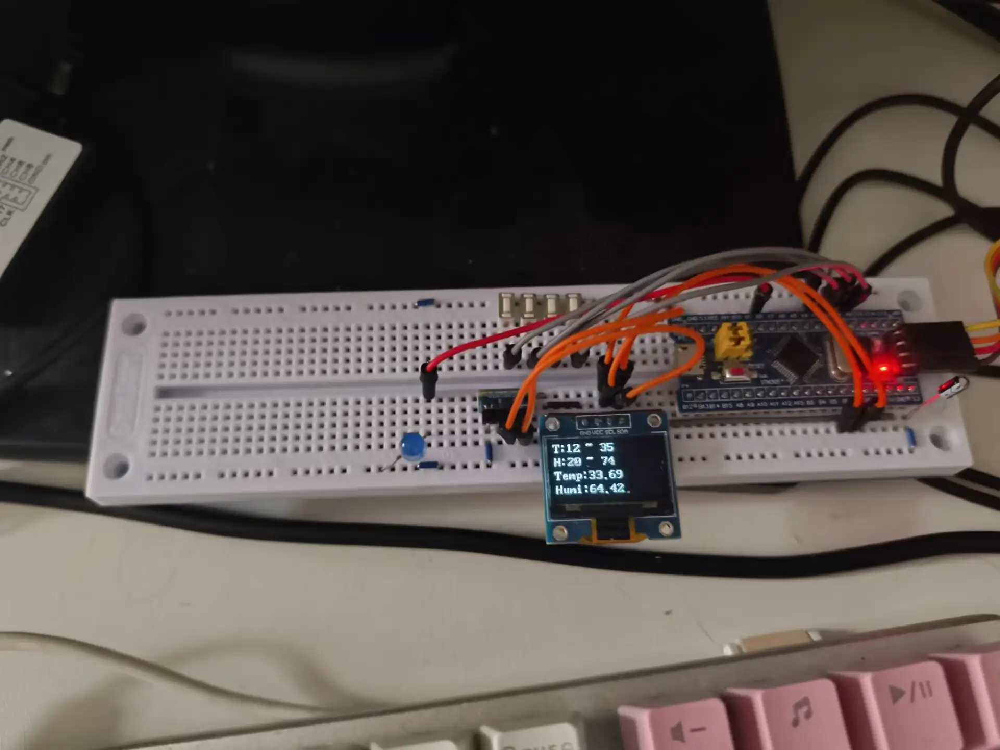
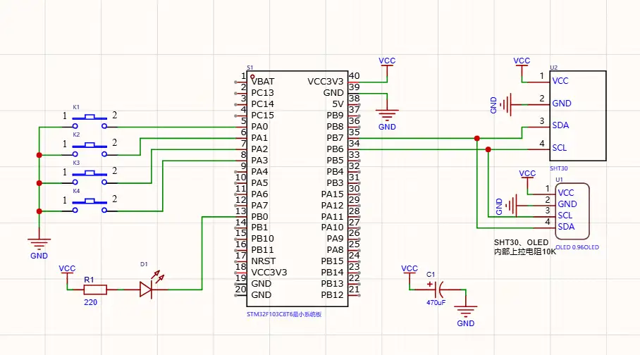

# STM32 环境监测系统

基于 STM32F103C8T6 的嵌入式环境监测系统，通过 SHT30 传感器采集温湿度数据，OLED 实时显示，支持四按键设置报警阈值，超出阈值时 LED 报警。

## 实物图
<p align="center">
  
</p>

## 硬件平台

| 模块 | 型号/说明 |
|------|----------|
| MCU | STM32F103C8T6 (LQFP48) |
| 温湿度传感器 | SHT30 (I2C) |
| 显示屏 | OLED SSD1315 128×64 (I2C) |
| 按键 | 4 个独立按键 (MENU / + / - / ENTER) |
| 报警 | LED |
| 存储 | STM32 内部 Flash (阈值参数掉电保存) |
- **需要在STM32的3.3V与GND之间外接一颗470uF电容，用于掉电存储的储能**

## 电路原理图
<p align="center">
  
</p>

## 软件架构

```
├── Core/                  # STM32CubeMX 生成的 HAL 代码
│   ├── Inc/               #   外设初始化头文件
│   └── Src/               #   main.c, i2c.c 等
├── Drivers/
│   ├── Bus/I2C/           # I2C 总线抽象层
│   ├── BSP/               # 板级支持包
│   │   ├── OLED/          #   OLED 驱动 (含 ASCII 字库)
│   │   ├── SHT30/         #   SHT30 温湿度传感器驱动
│   │   ├── LED/           #   LED 驱动
│   │   ├── KEY/           #   按键消抖与事件检测
│   │   └── FLASH/         #   内部 Flash 读写
│   ├── CMSIS/             # ARM CMSIS 核心头文件
│   └── STM32F1xx_HAL_Driver/  # STM32F1 HAL 库
├── APP/                   # 应用层
│   ├── Inc/
│   │   ├── env_monitor.h      # 环境监测模块 (周期采集 + OLED 刷新)
│   │   ├── alarm_ctrl.h       # 报警逻辑 (纯判断，与硬件解耦)
│   │   ├── key_handler.h      # 按键状态机 (菜单/加减/确认)
│   │   ├── param_manager.h    # 阈值管理 (RAM + Flash 持久化)
│   │   └── power_monitor.h    # PVD 掉电检测 (断电前保存阈值)
│   └── Src/               #   对应 .c 实现
├── cmake/                 # CMake 子项目 (STM32CubeMX 生成)
└── docs/
    └── images/             # 实物图、电路原理图
```

## 外设配置

| 外设 | 用途 | 配置 |
|------|------|------|
| I2C1 | SHT30 + OLED 通信 | 标准模式 |
| IWDG | 独立看门狗 | 64 预分频 / 1250 重载 ≈ 2 秒超时 |
| PVD | 掉电检测 | 2.9V 阈值，下降沿中断 |

## 功能说明

### 环境监测
上电后每秒自动采集温湿度数据并刷新 OLED 显示。显示内容包括当前温度、湿度和四个报警阈值。

### 阈值设置
通过四按键操作调节报警阈值：

- **MENU** — 循环切换选中字段 (温度下限 → 温度上限 → 湿度下限 → 湿度上限)
- **+ / -** — 对选中字段调节 ±3 单位
- **ENTER** — 退出调节模式

### 报警
当前温湿度任一超出对应阈值范围时，LED 点亮报警；全部正常时 LED 熄灭。

### 掉电保存
利用 STM32 内部 Flash 最后一页存储阈值参数。正常运行期间仅在 RAM 中修改阈值，系统掉电时通过 PVD 中断自动写入 Flash，避免频繁擦写。

### 看门狗
IWDG 独立看门狗提供约 2 秒超时保护，主循环内喂狗，程序异常时可自动复位。

## 设计说明

- **报警逻辑解耦**：alarm_ctrl 仅做阈值判断、输出报警状态，不直接操作 LED，便于后续扩展蜂鸣器、上报云端等其他报警方式
- **Flash 延迟写入**：阈值仅在系统掉电时通过 PVD 中断写入 Flash，运行期间只修改 RAM，避免频繁擦写造成的寿命损耗和主循环阻塞
- **I2C 总线抽象层**：将 SHT30 与 OLED 的 I2C 读写封装在 Bus/I2C 层，两个外设驱动均基于统一接口通信，便于后续扩展其他 I2C 设备
- **按键状态机设计**：MENU/+/-/ENTER 四键通过状态机管理选中字段与调节模式，避免多按键交互时的逻辑耦合，便于后续扩展长按连续调节等功能

## 开发环境

使用 STM32CubeMX 生成初始工程，通过 CLion + ARM GCC 工具链进行开发与编译。
烧录使用 ST-Link

## 引脚分配

| 引脚 | 功能 |
|------|------|
| PB6 | I2C1 SCL (SHT30 + OLED) |
| PB7 | I2C1 SDA (SHT30 + OLED) |
| PA0 | 按键 MENU (上拉输入) |
| PA1 | 按键 PLUS (上拉输入) |
| PA2 | 按键 MINUS (上拉输入) |
| PA3 | 按键 ENTER (上拉输入) |
| PB0 | LED 报警输出 |

## 许可

MIT License
